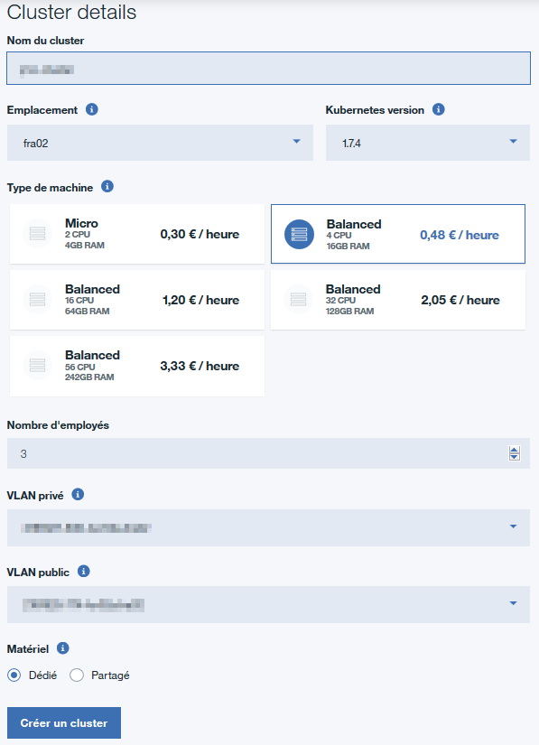
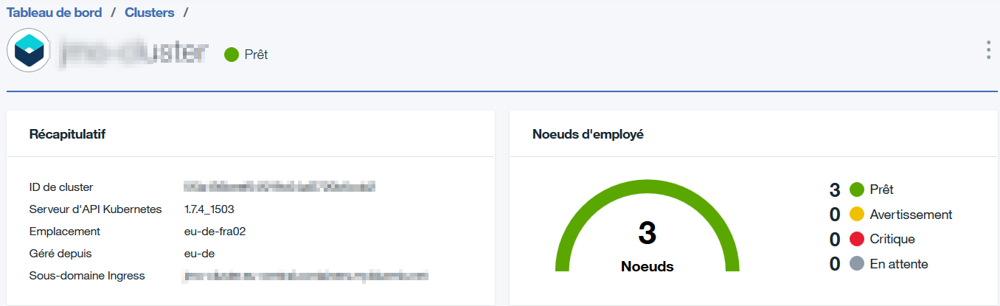
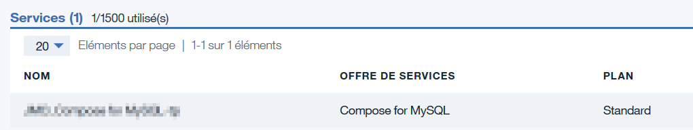

# Installer VTiger sur Bluemix avec Docker/Kubernetes
Déploiement d'une image VTiger sur l'environnement Bluemix en utilisant un plan Pay As You Go.
- Les commandes `bx cs` font appel au plugin **Container Service** de Bluemix
- Les commandes `bx cr` font appel au plugin **Container Regitry** de Bluemix

## Pre-requis

+ Avoir un [Bluemix IBM id](https://bluemix.net) avec un plan Pay As You Go
+ Installer la [Bluemix CLI](http://clis.ng.bluemix.net)
+ Installer docker for [Mac](https://docs.docker.com/engine/installation/mac/) or [Windows](https://docs.docker.com/engine/installation/windows/)
+ Installer [Kubectl](https://kubernetes.io/docs/user-guide/prereqs/)

## 1 Connexion à la console Bluemix
Se connecter à la console Bluemix <https://console.bluemix.net> et choisir une organisation et un espace.

## 2 Création du Cluster Kubernetes
Créer un cluster kubernetes via la console Bluemix.



Une fois le cluster créé et instancié vous devez avoir cette vue dans le tableau de bord des clusters



## 3 Création d'une base compose MySQL
Provisionner le service **Compose for MySQL** à partir de la page du catalogue de Bluemix ici : <https://console.bluemix.net/catalog/services/compose-for-mysql>

Une fois le service de base de données créé, vous devez visualiser votre base MySQL dans le tableau de bord de Bluemix.



## 4 Déploiement de l'image VTiger
Nous allons utiliser l'image VTiger 7.0.1 disponible sur DockerHub

### 4.1 Utilisation de la ligne de commande Bluemix et Kubectl
Se connecter à Bluemix en ligne de commande ```bx login``` et sélectionner une organisation et un espace ```bx target --cf```

_NB : sous Windows utiliser le ```Docker QuickStart Terminal``` de l'installation Docker_

1. Vérifier que le repository de plugins est installé dans la ligne de commande Bluemix

```bx plugin repos```

Output:

```
Listing added plug-in repositories...

Repo Name   URL
Bluemix     https://plugins.ng.bluemix.net
```

2. Si vous ne voyez pas le repository Bluemix, il faut l'installer:

```bx plugin repo-add Bluemix https://plugins.ng.bluemix.net```


3. Il faut ensuite installer les plugins container-registry et container-service:

Le plugin container-registry permet de vous connecter à une registry privée d'images dans Bluemix.

Le plugin container-service vous permet de gérer les clusters et les workers nodes dans Bluemix.

```
bx plugin install container-service -r Bluemix
bx plugin install container-registry -r Bluemix
```
Pour vérifier que tout est correctement installé, exécuter cette commande :
```
bx plugin list
```
Résultat : 
```
Listing installed plug-ins...

Plugin Name          Version
container-registry   0.1.215
container-service    0.1.360
```

4. Pour mettre à jour les plugins (si ils existaient déjà) utilisez ces commandes :
```
bx plugin update container-registry -r Bluemix
bx plugin update registry-service -r Bluemix
```
### 4.2 Vérification ou création de votre namespace dans la registry Bluemix
Se loguer sur le service de registry de Bluemix
```
bx cr login
output : Connexion à 'registry.eu-de.bluemix.net'...
```
Vérifier si vous avez déjà définie un namespace dans la registry Bluemix
```
bx cr namespaces
```
Si vous n'aviez pas déjà (la liste est vide), créé un namespace maintenant
```
bx cr namespace-add <your-namespace>
```
## 4.3. Récupération et push de l'image Vtiger
On récupère une image docker de la dernière version de VTiger 7.0.1 sur DockerHub <https://hub.docker.com/r/ldavid/vtiger7/>
```
docker pull ldavid/vtiger7
```
Une fois l'image récupérée, on va la taguée dans la registry Bluemix
```
docker tag ldavid/vtiger7 registry.eu-de.bluemix.net/<your-namespace>/vtiger7:1
```
Une fois taguée, l'image peut être poussée dans la registry
```
docker push registry.eu-de.bluemix.net/<your-namespace>/vtiger7:1
```
à ce moment là l'image est disponible dans Bluemix
```
bx cr images
```
Output :
```
Liste des images...

REFERENTIEL                                   ESPACE DE NOM   ETIQUETTE   CONDENSE       CREE           TAILLE   STATUT DE VULNERABILITE
registry.ng.bluemix.net/<your-namespace>/vtiger7   <your-namespace>     1           dc6492210a9b   3 months ago   230 MB   Vulnérable
```
## 3. Création des volumes persistants de stockage pour la base et pour Vtiger


Mettre à jour la configuration Kubernetes pour pouvoir utiliser la commande ```kubectl``` sur le cluster
```
bx cs cluster-config <cluster-name>
```

